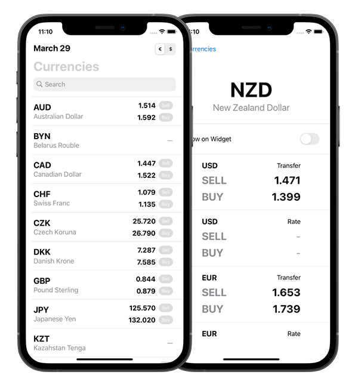

# CurRates App

## Description:

Implement simple currency rates check app using endpoint for currency rate.

## Features

- [x] SwiftUI
- [x] MVVM
- [x] without third parties
- [x] Unit tests
- [x] UI tests
- [x] Search bar input validation
- [x] ReverseUsdQuot
- [x] Today Widget extension

## Updates

- Network Layer has improved with Combine

